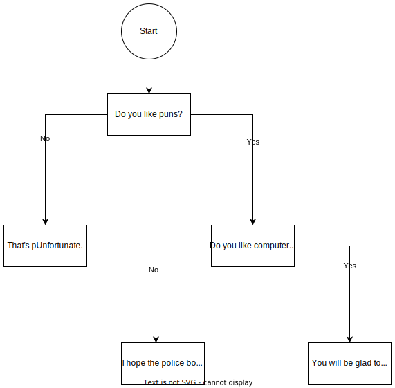

# Tute 02
## COMP1511 22T3
### Jack Robbers

---

# content

* assignment 0
* operators
* types

---

# assignment 0

cs_matches

due [time]

---

# operators

<!-- get groups to name operators, when you write them up ask for similarities and names of type of operator -->

--- 

| Type of Operator | Operators |
|---|---|
| Arithmetic | `+` `-` `*` `/` `%` |
|Logic | `&&` `\|\|` `!` |
|Comparison | `<` `>` `<=` `>=` `!=` `==` |

---

# flow charts

we don't directly assess you on these, but very useful

---

# leap year flow chart

<!-- groups to come up with flow charts for a leap year -->
* Years divisible by 4 are leap years. (e.g. 1904 was a leap year)
* Except, years divisible by 100 are not leap years. (e.g 1900 was NOT a leap year)
* Except, years divisible by 400 are always leap years. (e.g. 2000 was a leap year)

---

# types

what have we seen so far?

---

# expressions

"math / conventional" result (if it makes sense)?
result in C and what type does it have?

* `(7/2)`
* `(3.0 / 2) + 1`
* `'a' + 5`
* `'F' - 'A' + 'a'`

---

<!-- see expressions.c -->

| Expression | Math | C | C type |
| --- | --- | --- | --- |
| `(7/2)` | 3.5 | 3 | integer |
| `(3.0 / 2) + 1` | 2.5 | 2.5 | double |
| `'a' + 5` | ? | 'f' | char |
| `'F' - 'A' + 'a'` | ? | 'f' | char |

---

# programming

* Scans in two integers (`a` and `b`).
* If the first integer is less than the second, prints out a short error message using a procedure.
* If the second integer is 0, prints out a short error message.
* If the first integer is larger than the second, prints `a / b` and `(a * 1.0) / (b * 1.0)`.
